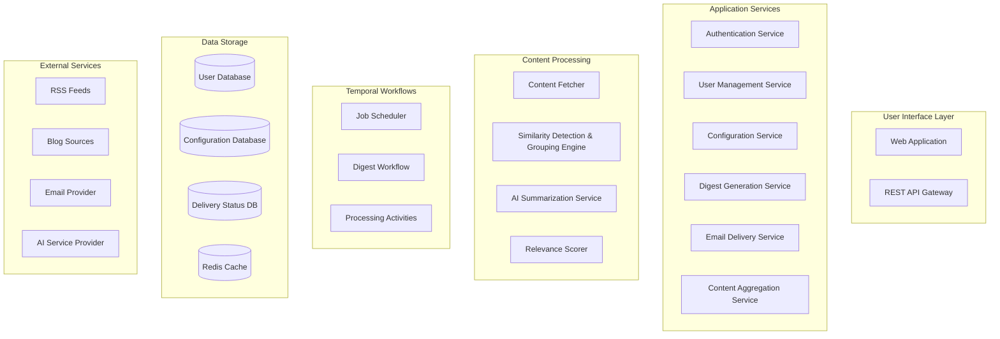

# Personal Daily Reading Digest - Project Overview

## Project Vision

The Personal Daily Reading Digest is a content curation platform that helps busy professionals stay informed by automatically aggregating, summarizing, and delivering personalized daily email digests from their preferred news sources, blogs, and publications.

## Core Value Proposition

- **Time-Saving**: Eliminates hours of manual browsing across multiple sources
- **Personalized**: Uses interest profiles and source preferences to deliver relevant content
- **Reliable**: Handles source failures gracefully and ensures consistent daily delivery
- **Intelligent**: AI-powered summarization and similarity detection for high-quality digests

## Primary User Story

A busy professional configures their preferred news sources, blogs, and publication types, sets their delivery time (e.g., 7 AM), and chooses their summary style. Each morning, they receive a curated email digest containing the most relevant articles from the past 24 hours, with similar articles grouped together and direct links to original sources.

## Technology Stack

### Backend
- **FastAPI**: High-performance Python web framework with automatic API documentation
- **PostgreSQL**: Reliable relational database for user data and configuration storage
- **PydanticAI**: AI framework for content summarization and processing
- **Temporal**: Workflow orchestration for complex content processing pipelines
- **Redis**: Caching layer for temporary content storage and session management

### Frontend
- **Vite**: Modern build tool with fast development server
- **Svelte**: Lightweight, reactive framework for user interfaces

### DevOps & Tools
- **Docker**: Containerization for consistent deployment
- **pytest**: Comprehensive testing framework
- **GitHub Actions**: CI/CD pipeline automation

## System Architecture

## Key Features & Requirements

### User Management (FR-001, FR-002)
- Account creation with email verification
- Source configuration interface
- Preference management (delivery time, summary style)

### Content Processing Pipeline
- **Source Validation** (FR-011): Lightweight availability checks
- **Content Aggregation** (FR-005): Daily fetch from configured sources
- **Similarity Detection & Grouping** (FR-006): Find and group similar articles using AI-powered semantic analysis
- **AI Summarization**: Generate consistent summaries using PydanticAI
- **Personalization** (FR-019-FR-023): Interest profile-based content prioritization

### Delivery System (FR-010, FR-013)
- Timezone-aware scheduling
- Email delivery with retry logic (up to 3 attempts)
- Delivery status tracking and failure handling

### Content Source Management (FR-015)
- Support for RSS feeds and blog URLs
- Custom source addition by users
- Graceful handling of unavailable sources

### Interest Profiling (FR-019-FR-023)
- Single interest profile per user (up to 50 keywords)
- Content prioritization and labeling
- Fallback for non-matching content

## Temporal Workflow Design

The content digest generation is orchestrated as a Temporal workflow to handle:
- **Parallel Processing**: Fetch content from multiple sources simultaneously
- **Fault Tolerance**: Resume from failure points without restarting entire pipeline
- **Complex Retry Logic**: Different retry strategies for different activities
- **Monitoring**: Visual workflow progress tracking
- **Graceful Degradation**: Handle partial source failures

### Main Workflow Steps
1. **Fetch User Configuration**: Retrieve sources, preferences, and interest profile
2. **Parallel Content Fetching**: Get articles from all configured sources
3. **Content Processing Pipeline**: Similarity Detection & Grouping → Summarization → Personalization
4. **Digest Assembly**: Create final email content with grouped similar articles and proper attribution
5. **Email Delivery**: Send with retry logic and status tracking

## Data Architecture

### Persistent Data
- **User Accounts**: Authentication credentials, verified emails, timezone settings
- **Configuration**: Source definitions, delivery preferences, interest profiles
- **Delivery Status**: Tracking logs (30-day retention)

### Transient Data
- **Article Content**: Fetched articles (not persisted beyond processing)
- **Generated Summaries**: Created during workflow execution only
- **Digest Content**: Assembled emails (sent but not stored)

## Launch Specifications

### Scale Targets
- **Initial Users**: 1,000
- **Sources per User**: 5 average, 20 maximum
- **Daily Article Volume**: ~20,000 raw articles before filtering
- **Processing SLA**: ≤15 minutes per user digest generation

### Content Specifications
- **Language Support**: English only at launch
- **Content Window**: Rolling 24 hours from generation time
- **Summary Length**: 500 words maximum per item
- **Delivery Window**: 30-minute acceptable delay from scheduled time

## Development Phases

### Phase 1: Core Platform (MVP)
- [ ] Basic source configuration (RSS feeds)
- [ ] Simple digest generation without AI
- [ ] Email delivery system
- [ ] Basic web interface (single-user or hardcoded config)

### Phase 2: AI Integration
- [ ] PydanticAI integration for summarization
- [ ] AI-powered similarity detection and grouping engine
- [ ] Temporal workflow implementation

### Phase 3: User Management & Personalization
- [ ] User authentication and account management
- [ ] Interest profile system
- [ ] Custom source support (blog URLs)
- [ ] Performance optimization

### Phase 4: Enhanced Features
- [ ] Advanced error handling and monitoring
- [ ] User experience improvements

### Phase 5: Production Ready
- [ ] Comprehensive testing suite
- [ ] CI/CD pipeline
- [ ] Docker deployment
- [ ] Monitoring and alerting

## Success Metrics

- **Reliability**: 95% of digests delivered within 15 minutes of scheduled time
- **User Engagement**: Regular use (daily open rates) above 70%
- **Content Quality**: Low user-reported spam/irrelevant content
- **System Stability**: <1% workflow failure rate
- **Performance**: Processing time scales linearly with user growth

## Related Documentation

- @backend/CLAUDE.md: Backend architecture and Development Guide
- @backend/docs/: Current plan and status
- @frontend/CLAUDE.md: Frontend architecture and Development Guide

## Key Assumptions & Constraints

- Public content sources only (no paywalled/authenticated sources)
- Email as primary delivery method (no push notifications)
- Single interest profile per user at launch
- No multi-tenancy or admin interfaces for initial release
- English content processing only
- AI summarization treated as external service dependency
