# Personal Daily Reading Digest - Backend Development Guide

## Overview

This document provides comprehensive guidance for developing the backend systems of the Personal Daily Reading Digest platform. The backend is built using FastAPI with PostgreSQL, integrated with PydanticAI for content processing and Temporal for workflow orchestration.

## Detailed System Architecture

```mermaid
graph TB
    %% External Clients
    CLIENT[Web Client] --> LB[Load Balancer]

    %% API Gateway Layer
    LB --> APIGW[API Gateway/Reverse Proxy]

    %% Application Layer
    subgraph "FastAPI Application Services"
        APIGW --> AUTH_API[Auth API Endpoints]
        APIGW --> USER_API[User Management API]
        APIGW --> CONFIG_API[Configuration API]
        APIGW --> STATUS_API[Status & Monitoring API]

        AUTH_API --> AUTH_SVC[Authentication Service]
        USER_API --> USER_SVC[User Service]
        CONFIG_API --> CONFIG_SVC[Configuration Service]
        STATUS_API --> STATUS_SVC[Status Service]
    end

    %% Core Business Logic
    subgraph "Business Services"
        USER_SVC --> USER_REPO[User Repository]
        CONFIG_SVC --> CONFIG_REPO[Config Repository]
        STATUS_SVC --> STATUS_REPO[Status Repository]

        EMAIL_SVC[Email Service]
        CONTENT_SVC[Content Service]
    end

    %% Temporal Workflow Layer
    subgraph "Temporal Workflows"
        TEMPORAL_WORKER[Temporal Worker]

        subgraph "Workflows"
            DIGEST_WF[Daily Digest Workflow]
            USER_ONBOARD_WF[User Onboarding Workflow]
            SOURCE_VALIDATION_WF[Source Validation Workflow]
        end

        subgraph "Activities"
            FETCH_CONFIG_ACT[Fetch User Config Activity]
            FETCH_CONTENT_ACT[Fetch Content Activity]
            SIMILARITY_ACT[Similarity Detection Activity]
            SUMMARIZE_ACT[Summarization Activity]
            PERSONALIZE_ACT[Personalization Activity]
            SEND_EMAIL_ACT[Send Email Activity]
            VALIDATE_SOURCE_ACT[Validate Source Activity]
        end

        DIGEST_WF --> FETCH_CONFIG_ACT
        DIGEST_WF --> FETCH_CONTENT_ACT
        DIGEST_WF --> SIMILARITY_ACT
        DIGEST_WF --> SUMMARIZE_ACT
        DIGEST_WF --> PERSONALIZE_ACT
        DIGEST_WF --> SEND_EMAIL_ACT

        USER_ONBOARD_WF --> VALIDATE_SOURCE_ACT
        SOURCE_VALIDATION_WF --> VALIDATE_SOURCE_ACT
    end

    %% Content Processing Pipeline
    subgraph "Content Processing Engines"
        CONTENT_FETCHER[Content Fetcher]
        RSS_PARSER[RSS Parser]
        BLOG_SCRAPER[Blog Scraper]

        SIMILARITY_ENGINE[Similarity Detection & Grouping Engine]
        SIMILARITY_CALC[Similarity Calculator]

        AI_PROCESSOR[AI Processing Service]
        SUMMARIZER[Summarization Engine]
        RELEVANCE_SCORER[Relevance Scorer]
    end

    %% Data Layer
    subgraph "Data Storage Layer"
        POSTGRES[(PostgreSQL)]
        REDIS[(Redis Cache)]

        subgraph "Database Schemas"
            USER_SCHEMA[User Schema]
            CONFIG_SCHEMA[Configuration Schema]
            STATUS_SCHEMA[Status Schema]
            AUDIT_SCHEMA[Audit Schema]
        end

        POSTGRES --> USER_SCHEMA
        POSTGRES --> CONFIG_SCHEMA
        POSTGRES --> STATUS_SCHEMA
        POSTGRES --> AUDIT_SCHEMA
    end

    %% External Services
    subgraph "External Services"
        RSS_FEEDS[RSS Feeds]
        BLOG_SOURCES[Blog Sources]
        EMAIL_PROVIDER[Email Provider - SendGrid/SES]
        AI_SERVICE[PydanticAI Service]
    end

    %% Monitoring & Observability
    subgraph "Observability"
        METRICS[Metrics Collector]
        LOGS[Log Aggregator]
        TEMPORAL_UI[Temporal Web UI]
    end

    %% Connections
    TEMPORAL_WORKER --> DIGEST_WF
    TEMPORAL_WORKER --> USER_ONBOARD_WF
    TEMPORAL_WORKER --> SOURCE_VALIDATION_WF

    FETCH_CONTENT_ACT --> CONTENT_FETCHER
    CONTENT_FETCHER --> RSS_PARSER
    CONTENT_FETCHER --> BLOG_SCRAPER
    RSS_PARSER --> RSS_FEEDS
    BLOG_SCRAPER --> BLOG_SOURCES

    SIMILARITY_ACT --> SIMILARITY_ENGINE
    SIMILARITY_ENGINE --> SIMILARITY_CALC

    SUMMARIZE_ACT --> AI_PROCESSOR
    PERSONALIZE_ACT --> AI_PROCESSOR
    AI_PROCESSOR --> SUMMARIZER
    AI_PROCESSOR --> RELEVANCE_SCORER
    AI_PROCESSOR --> AI_SERVICE

    SEND_EMAIL_ACT --> EMAIL_SVC
    EMAIL_SVC --> EMAIL_PROVIDER

    USER_REPO --> POSTGRES
    CONFIG_REPO --> CONFIG_SCHEMA
    STATUS_REPO --> STATUS_SCHEMA

    CONTENT_FETCHER --> REDIS
    SIMILARITY_ENGINE --> REDIS
    AI_PROCESSOR --> REDIS

    %% Monitoring connections
    TEMPORAL_WORKER --> METRICS
    AUTH_SVC --> LOGS
    USER_SVC --> LOGS
    CONFIG_SVC --> LOGS

    %% Styling
    classDef apiLayer fill:#e1f5fe,color:#000000
    classDef serviceLayer fill:#f3e5f5,color:#000000
    classDef temporalLayer fill:#e8f5e8,color:#000000
    classDef processLayer fill:#fff3e0,color:#000000
    classDef dataLayer fill:#fce4ec,color:#000000
    classDef externalLayer fill:#f1f8e9,color:#000000
    classDef observabilityLayer fill:#fff8e1,color:#000000

    class APIGW,AUTH_API,USER_API,CONFIG_API,STATUS_API apiLayer
    class AUTH_SVC,USER_SVC,CONFIG_SVC,STATUS_SVC,EMAIL_SVC,CONTENT_SVC serviceLayer
    class TEMPORAL_WORKER,DIGEST_WF,USER_ONBOARD_WF,SOURCE_VALIDATION_WF,FETCH_CONFIG_ACT,FETCH_CONTENT_ACT,DEDUP_ACT,SUMMARIZE_ACT,PERSONALIZE_ACT,SEND_EMAIL_ACT,VALIDATE_SOURCE_ACT temporalLayer
    class CONTENT_FETCHER,RSS_PARSER,BLOG_SCRAPER,DEDUP_ENGINE,SIMILARITY_CALC,AI_PROCESSOR,SUMMARIZER,RELEVANCE_SCORER processLayer
    class POSTGRES,REDIS,USER_SCHEMA,CONFIG_SCHEMA,STATUS_SCHEMA,AUDIT_SCHEMA dataLayer
    class RSS_FEEDS,BLOG_SOURCES,EMAIL_PROVIDER,AI_SERVICE externalLayer
    class METRICS,LOGS,TEMPORAL_UI observabilityLayer
```



## Project Structure

```
app/
├── __init__.py
├── main.py                    # FastAPI application entry point
├── config.py                  # Configuration and environment variables
├── database.py                # Database connection and session management
├── dependencies.py            # FastAPI dependencies
├── exceptions.py              # Custom exception classes
├── middlewares.py             # Custom middleware
│
├── api/                       # API layer
│   ├── __init__.py
│   ├── deps.py               # API dependencies
│   ├── auth.py               # Authentication endpoints
│   ├── users.py              # User management endpoints
│   ├── config.py             # Configuration endpoints
│   ├── status.py             # Status and health endpoints
│   └── schemas/              # Pydantic schemas
│       ├── __init__.py
│       ├── auth.py
│       ├── users.py
│       ├── config.py
│       └── common.py
│
├── services/                  # Business logic layer
│   ├── __init__.py
│   ├── auth.py               # Authentication service
│   ├── users.py              # User management service
│   ├── config.py             # Configuration service
│   ├── email.py              # Email service
│   └── content.py            # Content processing service
│
├── repositories/              # Data access layer
│   ├── __init__.py
│   ├── base.py               # Base repository class
│   ├── users.py              # User repository
│   ├── config.py             # Configuration repository
│   └── status.py             # Status repository
│
├── models/                    # SQLAlchemy models
│   ├── __init__.py
│   ├── base.py               # Base model class
│   ├── users.py              # User models
│   ├── config.py             # Configuration models
│   └── status.py             # Status models
│
├── temporal/                  # Temporal workflows and activities
│   ├── __init__.py
│   ├── worker.py             # Temporal worker setup
│   ├── client.py             # Temporal client configuration
│   ├── workflows/
│   │   ├── __init__.py
│   │   ├── digest.py         # Daily digest workflow
│   │   ├── onboarding.py     # User onboarding workflow
│   │   └── validation.py     # Source validation workflow
│   └── activities/
│       ├── __init__.py
│       ├── content.py        # Content fetching activities
│       ├── processing.py     # Content processing activities
│       ├── email.py          # Email activities
│       └── validation.py     # Validation activities
│
├── processors/                # Content processing engines (✅ COMPLETED)
│   ├── __init__.py
│   ├── ai_provider.py        # AI provider abstraction (✅ IMPLEMENTED)
│   ├── similarity_detector.py # Similarity detection & grouping (✅ IMPLEMENTED)
│   ├── topic_extractor.py    # Topic extraction service (✅ IMPLEMENTED)
│   ├── fetchers/              # Content fetchers with pluggable implementations
│   │   ├── __init__.py
│   │   ├── base.py           # Abstract base fetcher interface (✅ IMPLEMENTED)
│   │   ├── rss.py            # RSS/Atom feed fetcher (✅ IMPLEMENTED)
│   │   ├── factory.py        # Fetcher factory pattern (✅ IMPLEMENTED)
│   │   ├── exceptions.py     # Custom fetcher exceptions (✅ IMPLEMENTED)
│   │   └── blog.py           # Blog scraper (planned for future)
│   └── utils/                # Processing utilities
│       ├── __init__.py
│       ├── http_client.py    # HTTP client with retry logic (✅ IMPLEMENTED)
│       ├── url_validation.py # URL validation utilities (✅ IMPLEMENTED)
│       └── text_processing.py # Text utilities (planned)
│
└── utils/                     # Utilities and helpers
    ├── __init__.py
    ├── cache.py              # Cache utilities
    ├── redis_client.py       # Redis client utilities
    ├── logging.py            # Logging configuration
    ├── monitoring.py         # Metrics and monitoring
    └── validators.py         # Custom validators
```

## Core Design Principles

### 1. Repository Pattern

Clean separation between business logic and data access layers. Repositories handle all database operations while services contain business logic. This pattern allows for easier testing and maintains single responsibility principle.

### 2. Dependency Injection

Use FastAPI's dependency injection system to manage service dependencies. Database sessions are injected through middleware, and services are composed using dependency providers. This promotes loose coupling and testability.

### 3. Session Management with Middleware

Custom ORM session middleware manages database sessions per request. Sessions are automatically created, managed, and cleaned up with proper error handling and rollback support. Dirty session detection prevents uncommitted changes.

### 4. Error Handling Strategy

Implement hierarchical custom exceptions for different error types (business logic, validation, external services). Use global exception handlers to provide consistent API responses and proper HTTP status codes. For HTTP client operations, leverage native aiohttp exceptions (ClientResponseError, TimeoutError, ClientError) rather than custom wrapper exceptions to maintain simplicity and standard library compatibility.

## Database Design Guidelines

### Schema Design Rules

1. **Use ULIDs for primary keys** - Better for distributed systems, sortable by creation time
2. **Include audit fields** - created_at, updated_at using mixins
3. **Soft delete pattern** - Use deleted_at instead of hard deletes (future enhancement)
4. **Proper indexing** - Index foreign keys and frequently queried fields
5. **Constraints** - Use database constraints for data integrity

### Base Model Patterns

- **ULID Mixin**: Provides string-based primary keys that are sortable and distributed-system friendly
- **Timestamp Mixin**: Automatic created_at and updated_at fields with database-level defaults
- **SQLModel Integration**: Combine with SQLModel for type-safe ORM with automatic API schema generation

### Key Entity Relationships

- **User**: Central entity with email-based authentication, timezone awareness, and verification status
- **DigestConfiguration**: Per-user settings for delivery time, summary style, and source management
- **ContentSource**: User-configured RSS feeds and blog URLs with validation status
- **InterestProfile**: Keyword-based personalization with relevance scoring

## Temporal Workflow Design Patterns

### 1. Workflow Composition

Break complex workflows into smaller, reusable child workflows. Use workflow orchestration to coordinate multiple sub-workflows for configuration fetching, content processing, and email delivery. This enables better fault isolation and reusability.

### 2. Activity Design Rules

- **Idempotent**: Safe to retry without side effects
- **Deterministic**: Same input produces same output
- **Single Responsibility**: One clear purpose per activity
- **Timeout Aware**: Always set appropriate timeouts for different activity types

### 3. Error Handling Strategies

Implement proper retry policies with exponential backoff for transient failures. Use fallback processing for partial results when some sources fail. Design workflows to gracefully degrade rather than completely fail, ensuring digest delivery even with reduced content.

## Content Processing Architecture

### 1. RSS Feed Fetching Layer (✅ IMPLEMENTED)

Complete implementation of RSS 2.0 and Atom 1.0 feed parsing with comprehensive error handling and content extraction capabilities.

**Key Components:**

- **Base Fetcher Interface**: Abstract class defining standard fetcher methods for validation, content fetching, and metadata extraction
- **RSS/Atom Parser**: Full-featured parser supporting both feed formats with graceful handling of malformed content
- **Factory Pattern**: Automatic fetcher selection based on URL scheme and content type detection
- **HTTP Client**: Simplified async client with streamlined retry logic, native aiohttp exception handling, and connection lifecycle management
- **URL Validation**: Comprehensive validation utilities for feed URLs and health checking

**Features:**

- Support for RSS 2.0 and Atom 1.0 formats using feedparser library
- Simplified error handling using native aiohttp exceptions (ClientResponseError, TimeoutError, ClientError)
- Unified exception handling with consolidated retry logic for better maintainability
- Content cleaning and text normalization
- Metadata extraction (author, tags, publish dates, feed info)
- Streamlined retry policies with fixed delay backoff for predictable behavior
- Comprehensive test suite with 73 passing tests covering unit, integration, and edge cases

### 2. AI Provider Abstraction (✅ IMPLEMENTED)

Pluggable AI model architecture enabling easy switching between different AI providers.

**Key Components:**

- **AIProvider Protocol**: Interface defining the `create_agent()` method for provider implementations
- **GeminiProvider**: Implementation for Google Gemini models with PydanticAI integration
- **OpenAIProvider**: Placeholder for future OpenAI integration
- **Factory Function**: `create_ai_provider()` for configuration-driven provider instantiation

**Features:**

- Protocol-based design for extensibility
- Configuration-driven model selection via `AI_PROVIDER` environment variable
- Dependency injection pattern for enhanced testability
- Easy addition of new providers (Anthropic, Cohere, etc.)
- All 17 similarity detector tests passing with mock provider

**Implementation Details:**

- Located in `app/processors/ai_provider.py`
- Used by `SimilarityDetector` for AI-powered semantic analysis
- Provider instances are created once and reused throughout the detection pipeline
- Tests mock the provider interface for deterministic unit testing

### 3. Similarity Detection & Grouping Engine (✅ IMPLEMENTED)

AI-powered semantic analysis to detect and group similar articles from different sources using the AI provider abstraction.

**Key Features:**

- Uses configurable AI providers via the abstraction layer
- Pairwise article comparison with structured AI output
- Connected components algorithm for efficient grouping
- Topic aggregation from all articles in groups (sourced from Article.ai_topics field)
- Redis caching (24-hour TTL) to avoid redundant AI calls
- Configurable similarity threshold (default: 0.7)
- Graceful error handling with fallback behavior
- Comprehensive test suite (21 tests)

### 4. Topic Extraction Service (✅ IMPLEMENTED)

AI-powered topic identification for article categorization and relevance scoring.

**Key Features:**

- Uses configurable AI providers via the abstraction layer
- Extracts 3-5 key topics/themes from article content
- Structured output using Pydantic models (TopicExtractionResult)
- Configurable max topics limit (default: 5, via TOPIC_EXTRACTION_MAX_TOPICS)
- Content truncation to 1000 characters for efficient token usage
- Graceful error handling with fallback to empty list
- Article model enhanced with ai_topics field for storing extracted topics
- Comprehensive test suite (19 tests)

### 5. Processing Pipeline (Planned for Phase 2)

Chain of responsibility pattern for content processing stages: validation, topic extraction (✅ complete), similarity detection (✅ complete), summarization, and personalization. Each processor in the pipeline transforms the content before passing to the next stage, enabling modular and testable processing.

## Configuration Management

### Environment-based Configuration

Use Pydantic BaseSettings for type-safe configuration management. Key configuration categories:

- **Database**: Connection URLs and pool settings
- **Caching**: Redis connection and TTL settings
- **Temporal**: Host, port, and namespace configuration
- **External Services**: Email provider API keys and endpoints
- **AI Provider Settings**:
    - `AI_PROVIDER`: Provider selection (gemini, openai, etc.)
    - `GEMINI_API_KEY`: Google Gemini API key
    - `GEMINI_MODEL`: Model name (default: gemini-2.5-flash-lite)
- **Similarity Detection**:
    - `SIMILARITY_THRESHOLD`: Minimum confidence (default: 0.7)
    - `SIMILARITY_CACHE_TTL_MINUTES`: Cache duration (default: 1440)
- **Topic Extraction**:
    - `TOPIC_EXTRACTION_MAX_TOPICS`: Maximum topics per article (default: 5)
- **Security**: JWT secrets, expiration times, and encryption keys

Support for .env files and environment variable overrides with proper validation and type checking.

## Testing Strategy

### 1. Test Structure

Organize tests into layers: unit tests for individual components, integration tests for component interactions, temporal-specific tests using Temporal's test framework, and shared fixtures for test data.

### 2. Testing Guidelines

- **Unit Tests**: Test individual functions/methods in isolation with mocked dependencies
- **Integration Tests**: Test component interactions including API endpoints and database operations
- **Workflow Tests**: Use Temporal's test framework for workflow and activity testing
- **Database Tests**: Use dedicated test database with proper cleanup between tests
- **Mock External Services**: Avoid hitting real APIs in tests, use mocks for external dependencies
- **RSS Feed Processing Tests**: Comprehensive test suite covering simplified HTTP client with native aiohttp exceptions, URL validation, RSS/Atom parsing, factory pattern, and unified error handling scenarios (73 tests)
- **AI Provider Tests**: Mock AI provider interface for deterministic testing of similarity detection and topic extraction without calling real AI APIs
- **Similarity Detection Tests**: Complete test suite with mock AI provider for grouping logic, topic aggregation, and caching behavior (21 tests)
- **Topic Extraction Tests**: Complete test suite covering topic extraction, error handling, content validation, and max topics enforcement (19 tests)
- **Total Processor Tests**: ~149 comprehensive tests across all content processing components

### 3. Test Configuration Approach

Use pytest-mock-resources for PostgreSQL test fixtures with pgvector support. Configure separate test databases per worker for parallel test execution. Implement proper session management with automatic cleanup and rollback on test failures.

## Performance and Monitoring

### 1. Caching Strategy

- **Redis Usage**: Cache user configurations, processed content (24h TTL), and API responses
- **Cache Keys**: Structured naming convention for consistent access patterns
- **Cache Invalidation**: Event-based invalidation triggered by configuration changes

### 2. Monitoring Points

- **API Metrics**: Request count, response time, error rates across endpoints
- **Workflow Metrics**: Execution time, failure rates, retry counts for Temporal workflows
- **Database Metrics**: Connection pool utilization and query performance
- **External Service Metrics**: API call success rates and response times for external dependencies

### 3. Logging Standards

Use structured logging with Loguru for correlation IDs and contextual information. Configure separate handlers for console output (INFO level) and file logging (DEBUG level) with automatic rotation and retention policies. Include user IDs and operation context for request tracing.

## Coding Guidelines

### String Formatting and Multi-line Text

**Always use `textwrap.dedent()` for multi-line strings**, especially for:
- AI prompts (system prompts, user prompts)
- SQL queries
- Error messages
- Documentation strings
- Configuration templates

This ensures proper formatting and prevents indentation issues that can affect AI model performance or code readability.

**Example - AI System Prompts:**
```python
import textwrap
from pydantic_ai import Agent

# ✅ GOOD: Clean, well-formatted prompt
agent = provider.create_agent(
    output_type=MyResult,
    system_prompt=textwrap.dedent("""\
        You are an expert at analyzing content.
        Your task is to identify key patterns.

        Guidelines:
        - Be specific and concise
        - Provide reasoning for your decisions
        - Use structured output format
    """),
)

# ❌ BAD: Awkward formatting, hard to read
agent = provider.create_agent(
    output_type=MyResult,
    system_prompt=(
        "You are an expert at analyzing content."
        "Your task is to identify key patterns."
        "Guidelines:"
        "- Be specific and concise"
        "- Provide reasoning for your decisions"
    ),
)
```

**Example - User Prompts:**
```python
# ✅ GOOD: Clean formatting with f-strings
prompt = textwrap.dedent(f"""\
    Article Title: {article.title}
    Content: {article.content}

    Analyze this article and provide insights.
""")

# ❌ BAD: Hard to read, no structure
prompt = f"Article Title: {article.title}\nContent: {article.content}\n\nAnalyze this article and provide insights."
```

**Why this matters:**
- AI models perform better with well-formatted, structured prompts
- Code is more readable and maintainable
- Easier to update and modify prompts
- Consistent formatting across the codebase

## Security Considerations

### 1. Authentication & Authorization

- JWT tokens with proper expiration
- Email verification required before digest delivery
- Rate limiting on API endpoints
- Input validation on all endpoints

### 2. Data Protection

- Hash sensitive data (passwords using bcrypt)
- Encrypt configuration data if needed
- Secure external API keys
- HTTPS-only communications

### 3. Content Security

- Validate all external URLs before fetching
- Sanitize scraped content
- Implement rate limiting for external requests
- Handle malicious content gracefully