# Personal Daily Reading Digest - Backend Development Guide

## Overview

This document provides comprehensive guidance for developing the backend systems of the Personal Daily Reading Digest platform. The backend is built using FastAPI with PostgreSQL, integrated with PydanticAI for content processing and Temporal for workflow orchestration.

## Detailed System Architecture

```mermaid
graph TB
    %% External Clients
    CLIENT[Web Client] --> LB[Load Balancer]

    %% API Gateway Layer
    LB --> APIGW[API Gateway/Reverse Proxy]

    %% Application Layer
    subgraph "FastAPI Application Services"
        APIGW --> AUTH_API[Auth API Endpoints]
        APIGW --> USER_API[User Management API]
        APIGW --> CONFIG_API[Configuration API]
        APIGW --> STATUS_API[Status & Monitoring API]

        AUTH_API --> AUTH_SVC[Authentication Service]
        USER_API --> USER_SVC[User Service]
        CONFIG_API --> CONFIG_SVC[Configuration Service]
        STATUS_API --> STATUS_SVC[Status Service]
    end

    %% Core Business Logic
    subgraph "Business Services"
        USER_SVC --> USER_REPO[User Repository]
        CONFIG_SVC --> CONFIG_REPO[Config Repository]
        STATUS_SVC --> STATUS_REPO[Status Repository]

        EMAIL_SVC[Email Service]
        CONTENT_SVC[Content Service]
    end

    %% Temporal Workflow Layer
    subgraph "Temporal Workflows"
        TEMPORAL_WORKER[Temporal Worker]

        subgraph "Workflows"
            DIGEST_WF[Daily Digest Workflow]
            USER_ONBOARD_WF[User Onboarding Workflow]
            SOURCE_VALIDATION_WF[Source Validation Workflow]
        end

        subgraph "Activities"
            FETCH_CONFIG_ACT[Fetch User Config Activity]
            FETCH_CONTENT_ACT[Fetch Content Activity]
            DEDUP_ACT[Deduplication Activity]
            SUMMARIZE_ACT[Summarization Activity]
            PERSONALIZE_ACT[Personalization Activity]
            SEND_EMAIL_ACT[Send Email Activity]
            VALIDATE_SOURCE_ACT[Validate Source Activity]
        end

        DIGEST_WF --> FETCH_CONFIG_ACT
        DIGEST_WF --> FETCH_CONTENT_ACT
        DIGEST_WF --> DEDUP_ACT
        DIGEST_WF --> SUMMARIZE_ACT
        DIGEST_WF --> PERSONALIZE_ACT
        DIGEST_WF --> SEND_EMAIL_ACT

        USER_ONBOARD_WF --> VALIDATE_SOURCE_ACT
        SOURCE_VALIDATION_WF --> VALIDATE_SOURCE_ACT
    end

    %% Content Processing Pipeline
    subgraph "Content Processing Engines"
        CONTENT_FETCHER[Content Fetcher]
        RSS_PARSER[RSS Parser]
        BLOG_SCRAPER[Blog Scraper]

        DEDUP_ENGINE[Deduplication Engine]
        SIMILARITY_CALC[Similarity Calculator]

        AI_PROCESSOR[AI Processing Service]
        SUMMARIZER[Summarization Engine]
        RELEVANCE_SCORER[Relevance Scorer]
    end

    %% Data Layer
    subgraph "Data Storage Layer"
        POSTGRES[(PostgreSQL)]
        REDIS[(Redis Cache)]

        subgraph "Database Schemas"
            USER_SCHEMA[User Schema]
            CONFIG_SCHEMA[Configuration Schema]
            STATUS_SCHEMA[Status Schema]
            AUDIT_SCHEMA[Audit Schema]
        end

        POSTGRES --> USER_SCHEMA
        POSTGRES --> CONFIG_SCHEMA
        POSTGRES --> STATUS_SCHEMA
        POSTGRES --> AUDIT_SCHEMA
    end

    %% External Services
    subgraph "External Services"
        RSS_FEEDS[RSS Feeds]
        BLOG_SOURCES[Blog Sources]
        EMAIL_PROVIDER[Email Provider - SendGrid/SES]
        AI_SERVICE[PydanticAI Service]
    end

    %% Monitoring & Observability
    subgraph "Observability"
        METRICS[Metrics Collector]
        LOGS[Log Aggregator]
        TEMPORAL_UI[Temporal Web UI]
    end

    %% Connections
    TEMPORAL_WORKER --> DIGEST_WF
    TEMPORAL_WORKER --> USER_ONBOARD_WF
    TEMPORAL_WORKER --> SOURCE_VALIDATION_WF

    FETCH_CONTENT_ACT --> CONTENT_FETCHER
    CONTENT_FETCHER --> RSS_PARSER
    CONTENT_FETCHER --> BLOG_SCRAPER
    RSS_PARSER --> RSS_FEEDS
    BLOG_SCRAPER --> BLOG_SOURCES

    DEDUP_ACT --> DEDUP_ENGINE
    DEDUP_ENGINE --> SIMILARITY_CALC

    SUMMARIZE_ACT --> AI_PROCESSOR
    PERSONALIZE_ACT --> AI_PROCESSOR
    AI_PROCESSOR --> SUMMARIZER
    AI_PROCESSOR --> RELEVANCE_SCORER
    AI_PROCESSOR --> AI_SERVICE

    SEND_EMAIL_ACT --> EMAIL_SVC
    EMAIL_SVC --> EMAIL_PROVIDER

    USER_REPO --> POSTGRES
    CONFIG_REPO --> CONFIG_SCHEMA
    STATUS_REPO --> STATUS_SCHEMA

    CONTENT_FETCHER --> REDIS
    DEDUP_ENGINE --> REDIS
    AI_PROCESSOR --> REDIS

    %% Monitoring connections
    TEMPORAL_WORKER --> METRICS
    AUTH_SVC --> LOGS
    USER_SVC --> LOGS
    CONFIG_SVC --> LOGS

    %% Styling
    classDef apiLayer fill:#e1f5fe,color:#000000
    classDef serviceLayer fill:#f3e5f5,color:#000000
    classDef temporalLayer fill:#e8f5e8,color:#000000
    classDef processLayer fill:#fff3e0,color:#000000
    classDef dataLayer fill:#fce4ec,color:#000000
    classDef externalLayer fill:#f1f8e9,color:#000000
    classDef observabilityLayer fill:#fff8e1,color:#000000

    class APIGW,AUTH_API,USER_API,CONFIG_API,STATUS_API apiLayer
    class AUTH_SVC,USER_SVC,CONFIG_SVC,STATUS_SVC,EMAIL_SVC,CONTENT_SVC serviceLayer
    class TEMPORAL_WORKER,DIGEST_WF,USER_ONBOARD_WF,SOURCE_VALIDATION_WF,FETCH_CONFIG_ACT,FETCH_CONTENT_ACT,DEDUP_ACT,SUMMARIZE_ACT,PERSONALIZE_ACT,SEND_EMAIL_ACT,VALIDATE_SOURCE_ACT temporalLayer
    class CONTENT_FETCHER,RSS_PARSER,BLOG_SCRAPER,DEDUP_ENGINE,SIMILARITY_CALC,AI_PROCESSOR,SUMMARIZER,RELEVANCE_SCORER processLayer
    class POSTGRES,REDIS,USER_SCHEMA,CONFIG_SCHEMA,STATUS_SCHEMA,AUDIT_SCHEMA dataLayer
    class RSS_FEEDS,BLOG_SOURCES,EMAIL_PROVIDER,AI_SERVICE externalLayer
    class METRICS,LOGS,TEMPORAL_UI observabilityLayer
```



## Development Environment Setup

### Python Package Management with UV

```
# Use UV for fast, reliable Python package management
install:
	uv add packege_to_install

install-dev:
	uv add packege_to_install --dev

sync:
	uv sync
```

### Makefile Commands

```makefile
# Makefile for Personal Daily Reading Digest

.PHONY: help install start stop test lint format clean

help:  ## Show this help message
	@echo "Available commands:"
	@grep -E '^[a-zA-Z_-]+:.*?## .*$$' $(MAKEFILE_LIST) | sort | awk 'BEGIN {FS = ":.*?## "}; {printf "\033[36m%-20s\033[0m %s\n", $$1, $$2}'

install:  ## Install dependencies with UV
	uv sync

start:  ## Start all services with Docker Compose
	docker compose up -d
	@echo "Services starting... Access API at http://localhost:8000"

stop:  ## Stop all services
	docker compose down

restart:  ## Restart all services
	docker compose restart

test:  ## Run pytest test suite
	pytest tests/ -v --cov=app --cov-report=html

lint:  ## Run linting checks
	ruff check app/ tests/
	mypy app/

format:  ## Format code with black and ruff
	ruff format app/ tests/

clean:  ## Clean up temporary files
	find . -type f -name "*.pyc" -delete
	find . -type d -name "__pycache__" -delete
	find . -type d -name "*.egg-info" -exec rm -rf {} +
	rm -rf .coverage htmlcov/ .pytest_cache/

db-migrate:  ## Run database migrations
	alembic upgrade head

db-rollback:  ## Rollback last migration
	alembic downgrade -1

db-reset:  ## Reset database (WARNING: drops all data)
	docker compose down -v
	docker compose up -d postgres
	sleep 5
	alembic upgrade head

temporal-ui:  ## Open Temporal Web UI
	@echo "Opening Temporal UI at http://localhost:8233"
	@which open >/dev/null && open http://localhost:8233 || echo "Navigate to http://localhost:8233"

dev:  ## Start development environment
	docker compose -f docker-compose.dev.yml up -d
	uvicorn app.main:app --host 0.0.0.0 --port 8000 --reload

build:  ## Build Docker images
	docker compose build

health:  ## Check service health
	curl -f http://localhost:8000/health || echo "API not responding"
	curl -f http://localhost:8233/api/v1/namespaces || echo "Temporal not responding"
```

## Project Structure

```
app/
├── __init__.py
├── main.py                    # FastAPI application entry point
├── config.py                  # Configuration and environment variables
├── database.py                # Database connection and session management
├── dependencies.py            # FastAPI dependencies
├── exceptions.py              # Custom exception classes
├── middleware.py              # Custom middleware
├──
├── api/                       # API layer
│   ├── __init__.py
│   ├── deps.py               # API dependencies
│   ├── auth.py               # Authentication endpoints
│   ├── users.py              # User management endpoints
│   ├── config.py             # Configuration endpoints
│   ├── status.py             # Status and health endpoints
│   └── schemas/              # Pydantic schemas
│       ├── __init__.py
│       ├── auth.py
│       ├── users.py
│       ├── config.py
│       └── common.py
│
├── services/                  # Business logic layer
│   ├── __init__.py
│   ├── auth.py               # Authentication service
│   ├── users.py              # User management service
│   ├── config.py             # Configuration service
│   ├── email.py              # Email service
│   └── content.py            # Content processing service
│
├── repositories/              # Data access layer
│   ├── __init__.py
│   ├── base.py               # Base repository class
│   ├── users.py              # User repository
│   ├── config.py             # Configuration repository
│   └── status.py             # Status repository
│
├── models/                    # SQLAlchemy models
│   ├── __init__.py
│   ├── base.py               # Base model class
│   ├── users.py              # User models
│   ├── config.py             # Configuration models
│   └── status.py             # Status models
│
├── temporal/                  # Temporal workflows and activities
│   ├── __init__.py
│   ├── worker.py             # Temporal worker setup
│   ├── client.py             # Temporal client configuration
│   ├── workflows/
│   │   ├── __init__.py
│   │   ├── digest.py         # Daily digest workflow
│   │   ├── onboarding.py     # User onboarding workflow
│   │   └── validation.py     # Source validation workflow
│   └── activities/
│       ├── __init__.py
│       ├── content.py        # Content fetching activities
│       ├── processing.py     # Content processing activities
│       ├── email.py          # Email activities
│       └── validation.py     # Validation activities
│
├── processors/                # Content processing engines
│   ├── __init__.py
│   ├── fetchers/
│   │   ├── __init__.py
│   │   ├── base.py           # Base fetcher interface
│   │   ├── rss.py            # RSS feed fetcher
│   │   └── blog.py           # Blog scraper
│   ├── ai/
│   │   ├── __init__.py
│   │   ├── summarizer.py     # AI summarization
│   │   ├── deduplicator.py   # Content deduplication
│   │   └── scorer.py         # Relevance scoring
│   └── utils/
│       ├── __init__.py
│       ├── similarity.py     # Similarity calculation
│       └── text_processing.py # Text utilities
│
└── utils/                     # Utilities and helpers
    ├── __init__.py
    ├── cache.py              # Redis cache utilities
    ├── logging.py            # Logging configuration
    ├── monitoring.py         # Metrics and monitoring
    └── validators.py         # Custom validators
```

## Core Design Principles

### 1. Repository Pattern
```python
# Clean separation between business logic and data access
class UserRepository:
    async def create(self, user: UserCreate) -> User:
        # Database operations
        pass

    async def get_by_email(self, email: str) -> Optional[User]:
        # Query operations
        pass

class UserService:
    def __init__(self, user_repo: UserRepository):
        self.user_repo = user_repo

    async def register_user(self, user_data: UserCreate) -> User:
        # Business logic
        return await self.user_repo.create(user_data)
```

### 2. Dependency Injection
```python
# Use FastAPI's dependency injection system
async def get_db() -> AsyncSession:
    async with async_session() as session:
        yield session

async def get_user_service(
    db: AsyncSession = Depends(get_db)
) -> UserService:
    return UserService(UserRepository(db))

@router.post("/users/")
async def create_user(
    user_data: UserCreate,
    user_service: UserService = Depends(get_user_service)
):
    return await user_service.register_user(user_data)
```

### 3. Error Handling Strategy
```python
# Custom exceptions for different error types
class BusinessLogicError(Exception):
    pass

class ValidationError(BusinessLogicError):
    pass

class ExternalServiceError(Exception):
    pass

# Global exception handlers
@app.exception_handler(ValidationError)
async def validation_exception_handler(request, exc):
    return JSONResponse(
        status_code=400,
        content={"error": "validation", "message": str(exc)}
    )
```

## Database Design Guidelines

### Schema Design Rules
1. **Use UUIDs for primary keys** - Better for distributed systems
2. **Include audit fields** - created_at, updated_at, created_by
3. **Soft delete pattern** - Use deleted_at instead of hard deletes
4. **Proper indexing** - Index foreign keys and frequently queried fields
5. **Constraints** - Use database constraints for data integrity

### Key Entities
```python
# User model with proper relationships
class User(Base):
    id: UUID = Column(UUID(as_uuid=True), primary_key=True, default=uuid4)
    email: str = Column(String, unique=True, nullable=False, index=True)
    is_verified: bool = Column(Boolean, default=False)
    timezone: str = Column(String, nullable=False)
    created_at: datetime = Column(DateTime, default=datetime.utcnow)

    # Relationships
    digest_config = relationship("DigestConfiguration", back_populates="user")
    delivery_logs = relationship("DeliveryLog", back_populates="user")

class DigestConfiguration(Base):
    id: UUID = Column(UUID(as_uuid=True), primary_key=True, default=uuid4)
    user_id: UUID = Column(UUID(as_uuid=True), ForeignKey("users.id"))
    delivery_time: time = Column(Time, nullable=False)
    summary_style: str = Column(String, nullable=False)  # 'brief' or 'detailed'
    is_active: bool = Column(Boolean, default=True)

    # Relationships
    user = relationship("User", back_populates="digest_config")
    sources = relationship("ContentSource", back_populates="config")
    interest_profile = relationship("InterestProfile", back_populates="config")
```

## Temporal Workflow Design Patterns

### 1. Workflow Composition
```python
# Break complex workflows into smaller, reusable workflows
@workflow.defn
class DigestGenerationWorkflow:
    @workflow.run
    async def run(self, user_id: str) -> DigestResult:
        # Orchestrate multiple sub-workflows
        config = await workflow.execute_child_workflow(
            FetchConfigurationWorkflow.run,
            user_id
        )

        content = await workflow.execute_child_workflow(
            ContentProcessingWorkflow.run,
            config
        )

        return await workflow.execute_child_workflow(
            EmailDeliveryWorkflow.run,
            user_id, content
        )
```

### 2. Activity Design Rules
- **Idempotent**: Safe to retry
- **Deterministic**: Same input = same output
- **Single Responsibility**: One clear purpose
- **Timeout Aware**: Always set appropriate timeouts

### 3. Error Handling in Workflows
```python
# Implement proper retry policies and error handling
@workflow.defn
class ContentProcessingWorkflow:
    @workflow.run
    async def run(self, config: DigestConfig) -> ProcessedContent:
        try:
            return await workflow.execute_activity(
                process_content,
                config,
                start_to_close_timeout=timedelta(minutes=10),
                retry_policy=RetryPolicy(
                    initial_interval=timedelta(seconds=30),
                    maximum_attempts=3,
                    backoff_coefficient=2.0
                )
            )
        except ActivityError as e:
            # Log error and return partial results
            workflow.logger.error(f"Content processing failed: {e}")
            return await self.fallback_processing(config)
```

## Content Processing Architecture

### 1. Fetcher Pattern
```python
# Abstract base class for all content fetchers
class ContentFetcher(ABC):
    @abstractmethod
    async def fetch(self, source: ContentSource) -> List[Article]:
        pass

    @abstractmethod
    async def validate_source(self, source_url: str) -> bool:
        pass

# Factory pattern for fetcher selection
class FetcherFactory:
    @staticmethod
    def get_fetcher(source_type: str) -> ContentFetcher:
        fetchers = {
            "rss": RSSFetcher(),
            "blog": BlogScraper()
        }
        return fetchers.get(source_type)
```

### 2. Processing Pipeline
```python
# Chain of responsibility pattern for content processing
class ContentProcessor:
    def __init__(self):
        self.pipeline = [
            ContentValidator(),
            Deduplicator(),
            Summarizer(),
            PersonalizationEngine()
        ]

    async def process(self, articles: List[Article], config: UserConfig) -> ProcessedContent:
        result = articles
        for processor in self.pipeline:
            result = await processor.process(result, config)
        return result
```

## Configuration Management

### Environment-based Configuration
```python
class Settings(BaseSettings):
    # Database
    database_url: str = Field(..., env="DATABASE_URL")

    # Redis
    redis_url: str = Field(..., env="REDIS_URL")

    # Temporal
    temporal_host: str = Field("localhost", env="TEMPORAL_HOST")
    temporal_port: int = Field(7233, env="TEMPORAL_PORT")

    # External Services
    email_provider: str = Field("sendgrid", env="EMAIL_PROVIDER")
    email_api_key: str = Field(..., env="EMAIL_API_KEY")

    # AI Services
    pydantic_ai_api_key: str = Field(..., env="PYDANTIC_AI_API_KEY")

    # Security
    secret_key: str = Field(..., env="SECRET_KEY")
    jwt_expire_minutes: int = Field(30, env="JWT_EXPIRE_MINUTES")

    class Config:
        env_file = ".env"
```

## Testing Strategy

### 1. Test Structure
```
tests/
├── unit/                  # Unit tests for individual components
│   ├── test_services.py
│   ├── test_repositories.py
│   └── test_processors.py
├── integration/           # Integration tests
│   ├── test_api.py
│   ├── test_workflows.py
│   └── test_database.py
├── temporal/              # Temporal-specific tests
│   ├── test_workflows.py
│   └── test_activities.py
└── fixtures/              # Test data and fixtures
    ├── users.py
    └── content.py
```

### 2. Testing Guidelines
- **Unit Tests**: Test individual functions/methods in isolation
- **Integration Tests**: Test component interactions
- **Workflow Tests**: Use Temporal's test framework
- **Database Tests**: Use test database with proper cleanup
- **Mock External Services**: Don't hit real APIs in tests

### 3. Test Configuration
```python
# conftest.py
@pytest.fixture
async def test_db():
    # Create test database
    engine = create_async_engine(TEST_DATABASE_URL)
    async with engine.begin() as conn:
        await conn.run_sync(Base.metadata.create_all)

    yield engine

    async with engine.begin() as conn:
        await conn.run_sync(Base.metadata.drop_all)

@pytest.fixture
def temporal_client():
    # Return test Temporal client
    return TemporalClient(host="localhost", port=7233)
```

## Performance and Monitoring

### 1. Caching Strategy
- **Redis Usage**: Cache user configs, processed content (24h), API responses
- **Cache Keys**: Structured naming convention (e.g., `user:config:{user_id}`)
- **Cache Invalidation**: Event-based invalidation on configuration changes

### 2. Monitoring Points
- **API Metrics**: Request count, response time, error rates
- **Workflow Metrics**: Execution time, failure rates, retry counts
- **Database Metrics**: Connection pool, query performance
- **External Service Metrics**: API call success rates, response times

### 3. Logging Standards
```python
# Structured logging with correlation IDs using Loguru
from loguru import logger

# Configure loguru logger
logger.configure(
    handlers=[
        {
            "sink": sys.stdout,
            "format": "{time:YYYY-MM-DD HH:mm:ss} | {level} | {name}:{function}:{line} | {extra[user_id]} | {extra[operation]} | {message}",
            "level": "INFO",
            "serialize": False
        },
        {
            "sink": "logs/app.log",
            "format": "{time:YYYY-MM-DD HH:mm:ss} | {level} | {name}:{function}:{line} | {extra} | {message}",
            "rotation": "1 day",
            "retention": "30 days",
            "level": "DEBUG"
        }
    ]
)

async def process_digest(user_id: str):
    log = logger.bind(user_id=user_id, operation="digest_generation")
    log.info("Starting digest generation")

    try:
        result = await generate_digest(user_id)
        log.info("Digest generation completed",
                article_count=len(result.articles))
        return result
    except Exception as e:
        log.error("Digest generation failed", error=str(e))
        raise
```

## Security Considerations

### 1. Authentication & Authorization
- JWT tokens with proper expiration
- Email verification required before digest delivery
- Rate limiting on API endpoints
- Input validation on all endpoints

### 2. Data Protection
- Hash sensitive data (passwords using bcrypt)
- Encrypt configuration data if needed
- Secure external API keys
- HTTPS-only communications

### 3. Content Security
- Validate all external URLs before fetching
- Sanitize scraped content
- Implement rate limiting for external requests
- Handle malicious content gracefully
