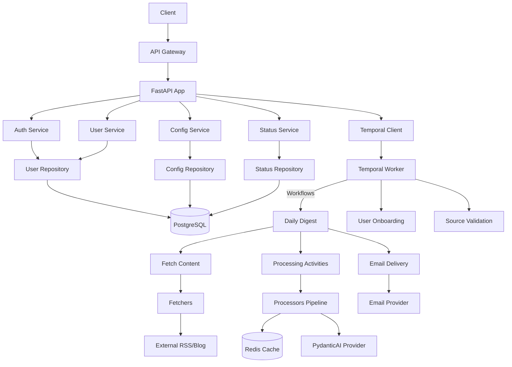

# Backend System Architecture

## TL;DR

- FastAPI handles HTTP; Temporal orchestrates long-running digest work.
- Article processing lives in `app/processors/`; each processor mutates/annotates an `Article` in sequence.
- PostgreSQL holds user/config state; Redis caches expensive processor results.

## Critical Invariants

- All persisted IDs are ULIDs; never assume monotonic integers.
- User configuration, sources, and interest profile must be fetched as a unit before starting personalization.
- Temporal workflows must remain idempotent: every activity checks existing state before writing.
- Processors only mutate `Article` objects; they never hit the database directly.

## System Diagram

## Module Responsibilities

| Layer | Location | Responsibilities | Notes |
| --- | --- | --- | --- |
| API | `app/api/` | Request/response schemas, HTTP routing, dependency wiring. | Always delegate business rules to services. |
| Services | `app/services/` | Orchestrate repositories, processors, and workflows. | Keep thin; favor pure helpers. |
| Repositories | `app/repositories/` | Encapsulate DB access via SQLModel. | No business logic. |
| Processors | `app/processors/` | Pure-ish article transformers (fetch, normalize, score, summarize). | Contracts documented per processor. |
| Temporal | `app/temporal/` | Workflow + activity definitions, worker bootstrap. | Activities call services/processors, never FastAPI endpoints. |
| Utilities | `app/utils/` | Shared helpers: caching, logging, validation. | Keep stateless. |

## Data Flow (Digest Workflow)

1. Load user configuration + interest profile (single transaction).
2. Fetch articles per source (parallel). Cache raw fetch results by feed hash for 24h.
3. Run processors in order: Normalizer → QualityScorer → TopicExtractor → RelevanceScorer → Summarizer → SimilarityDetector.
4. Assemble digest payload, store delivery attempt in status repo, send email.

## When Touching These Areas

- **Add new API route** → update schema in `app/api/schemas/`, ensure auth handled in `dependencies.py`, document invariant here if it changes data flow.
- **New processor** → follow `docs/processors/processor_template.md` (create if missing) and extend workflow activity list in `temporal-workflows.md`.
- **Workflow change** → record activity timeout/retry in `temporal-workflows.md` and ensure idempotency (check for duplicates before writes).
- **Cache strategy** → modify `docs/operations.md` cache table; avoid new Redis namespaces without documenting TTLs.

Keep architecture lean: if a change introduces a new cross-module dependency, call it out in this file before merging.
