# Backend System Architecture

## Detailed System Architecture

```mermaid
graph TB
    %% External Clients
    CLIENT[Web Client] --> LB[Load Balancer]

    %% API Gateway Layer
    LB --> APIGW[API Gateway/Reverse Proxy]

    %% Application Layer
    subgraph "FastAPI Application Services"
        APIGW --> AUTH_API[Auth API Endpoints]
        APIGW --> USER_API[User Management API]
        APIGW --> CONFIG_API[Configuration API]
        APIGW --> STATUS_API[Status & Monitoring API]

        AUTH_API --> AUTH_SVC[Authentication Service]
        USER_API --> USER_SVC[User Service]
        CONFIG_API --> CONFIG_SVC[Configuration Service]
        STATUS_API --> STATUS_SVC[Status Service]
    end

    %% Core Business Logic
    subgraph "Business Services"
        USER_SVC --> USER_REPO[User Repository]
        CONFIG_SVC --> CONFIG_REPO[Config Repository]
        STATUS_SVC --> STATUS_REPO[Status Repository]

        EMAIL_SVC[Email Service]
        CONTENT_SVC[Content Service]
    end

    %% Temporal Workflow Layer
    subgraph "Temporal Workflows"
        TEMPORAL_WORKER[Temporal Worker]

        subgraph "Workflows"
            DIGEST_WF[Daily Digest Workflow]
            USER_ONBOARD_WF[User Onboarding Workflow]
            SOURCE_VALIDATION_WF[Source Validation Workflow]
        end

        subgraph "Activities"
            FETCH_CONFIG_ACT[Fetch User Config Activity]
            FETCH_CONTENT_ACT[Fetch Content Activity]
            SIMILARITY_ACT[Similarity Detection Activity]
            SUMMARIZE_ACT[Summarization Activity]
            PERSONALIZE_ACT[Personalization Activity]
            SEND_EMAIL_ACT[Send Email Activity]
            VALIDATE_SOURCE_ACT[Validate Source Activity]
        end

        DIGEST_WF --> FETCH_CONFIG_ACT
        DIGEST_WF --> FETCH_CONTENT_ACT
        DIGEST_WF --> SIMILARITY_ACT
        DIGEST_WF --> SUMMARIZE_ACT
        DIGEST_WF --> PERSONALIZE_ACT
        DIGEST_WF --> SEND_EMAIL_ACT

        USER_ONBOARD_WF --> VALIDATE_SOURCE_ACT
        SOURCE_VALIDATION_WF --> VALIDATE_SOURCE_ACT
    end

    %% Content Processing Pipeline
    subgraph "Content Processing Engines"
        CONTENT_FETCHER[Content Fetcher]
        RSS_PARSER[RSS Parser]
        BLOG_SCRAPER[Blog Scraper]

        SIMILARITY_ENGINE[Similarity Detection & Grouping Engine]
        SIMILARITY_CALC[Similarity Calculator]

        AI_PROCESSOR[AI Processing Service]
        SUMMARIZER[Summarization Engine]
        RELEVANCE_SCORER[Relevance Scorer]
    end

    %% Data Layer
    subgraph "Data Storage Layer"
        POSTGRES[(PostgreSQL)]
        REDIS[(Redis Cache)]

        subgraph "Database Schemas"
            USER_SCHEMA[User Schema]
            CONFIG_SCHEMA[Configuration Schema]
            STATUS_SCHEMA[Status Schema]
            AUDIT_SCHEMA[Audit Schema]
        end

        POSTGRES --> USER_SCHEMA
        POSTGRES --> CONFIG_SCHEMA
        POSTGRES --> STATUS_SCHEMA
        POSTGRES --> AUDIT_SCHEMA
    end

    %% External Services
    subgraph "External Services"
        RSS_FEEDS[RSS Feeds]
        BLOG_SOURCES[Blog Sources]
        EMAIL_PROVIDER[Email Provider - SendGrid/SES]
        AI_SERVICE[PydanticAI Service]
    end

    %% Monitoring & Observability
    subgraph "Observability"
        METRICS[Metrics Collector]
        LOGS[Log Aggregator]
        TEMPORAL_UI[Temporal Web UI]
    end

    %% Connections
    TEMPORAL_WORKER --> DIGEST_WF
    TEMPORAL_WORKER --> USER_ONBOARD_WF
    TEMPORAL_WORKER --> SOURCE_VALIDATION_WF

    FETCH_CONTENT_ACT --> CONTENT_FETCHER
    CONTENT_FETCHER --> RSS_PARSER
    CONTENT_FETCHER --> BLOG_SCRAPER
    RSS_PARSER --> RSS_FEEDS
    BLOG_SCRAPER --> BLOG_SOURCES

    SIMILARITY_ACT --> SIMILARITY_ENGINE
    SIMILARITY_ENGINE --> SIMILARITY_CALC

    SUMMARIZE_ACT --> AI_PROCESSOR
    PERSONALIZE_ACT --> AI_PROCESSOR
    AI_PROCESSOR --> SUMMARIZER
    AI_PROCESSOR --> RELEVANCE_SCORER
    AI_PROCESSOR --> AI_SERVICE

    SEND_EMAIL_ACT --> EMAIL_SVC
    EMAIL_SVC --> EMAIL_PROVIDER

    USER_REPO --> POSTGRES
    CONFIG_REPO --> CONFIG_SCHEMA
    STATUS_REPO --> STATUS_SCHEMA

    CONTENT_FETCHER --> REDIS
    SIMILARITY_ENGINE --> REDIS
    AI_PROCESSOR --> REDIS

    %% Monitoring connections
    TEMPORAL_WORKER --> METRICS
    AUTH_SVC --> LOGS
    USER_SVC --> LOGS
    CONFIG_SVC --> LOGS

    %% Styling
    classDef apiLayer fill:#e1f5fe,color:#000000
    classDef serviceLayer fill:#f3e5f5,color:#000000
    classDef temporalLayer fill:#e8f5e8,color:#000000
    classDef processLayer fill:#fff3e0,color:#000000
    classDef dataLayer fill:#fce4ec,color:#000000
    classDef externalLayer fill:#f1f8e9,color:#000000
    classDef observabilityLayer fill:#fff8e1,color:#000000

    class APIGW,AUTH_API,USER_API,CONFIG_API,STATUS_API apiLayer
    class AUTH_SVC,USER_SVC,CONFIG_SVC,STATUS_SVC,EMAIL_SVC,CONTENT_SVC serviceLayer
    class TEMPORAL_WORKER,DIGEST_WF,USER_ONBOARD_WF,SOURCE_VALIDATION_WF,FETCH_CONFIG_ACT,FETCH_CONTENT_ACT,DEDUP_ACT,SUMMARIZE_ACT,PERSONALIZE_ACT,SEND_EMAIL_ACT,VALIDATE_SOURCE_ACT temporalLayer
    class CONTENT_FETCHER,RSS_PARSER,BLOG_SCRAPER,DEDUP_ENGINE,SIMILARITY_CALC,AI_PROCESSOR,SUMMARIZER,RELEVANCE_SCORER processLayer
    class POSTGRES,REDIS,USER_SCHEMA,CONFIG_SCHEMA,STATUS_SCHEMA,AUDIT_SCHEMA dataLayer
    class RSS_FEEDS,BLOG_SOURCES,EMAIL_PROVIDER,AI_SERVICE externalLayer
    class METRICS,LOGS,TEMPORAL_UI observabilityLayer
```



## Project Structure

```
app/
├── __init__.py
├── main.py                    # FastAPI application entry point
├── config.py                  # Configuration and environment variables
├── database.py                # Database connection and session management
├── dependencies.py            # FastAPI dependencies
├── exceptions.py              # Custom exception classes
├── middlewares.py             # Custom middleware
│
├── api/                       # API layer
│   ├── __init__.py
│   ├── deps.py               # API dependencies
│   ├── auth.py               # Authentication endpoints
│   ├── users.py              # User management endpoints
│   ├── config.py             # Configuration endpoints
│   ├── status.py             # Status and health endpoints
│   └── schemas/              # Pydantic schemas
│       ├── __init__.py
│       ├── auth.py
│       ├── users.py
│       ├── config.py
│       └── common.py
│
├── services/                  # Business logic layer
│   ├── __init__.py
│   ├── auth.py               # Authentication service
│   ├── users.py              # User management service
│   ├── config.py             # Configuration service
│   ├── email.py              # Email service
│   └── content.py            # Content processing service
│
├── repositories/              # Data access layer
│   ├── __init__.py
│   ├── base.py               # Base repository class
│   ├── users.py              # User repository
│   ├── config.py             # Configuration repository
│   └── status.py             # Status repository
│
├── models/                    # SQLAlchemy models
│   ├── __init__.py
│   ├── base.py               # Base model class
│   ├── users.py              # User models
│   ├── config.py             # Configuration models
│   └── status.py             # Status models
│
├── temporal/                  # Temporal workflows and activities
│   ├── __init__.py
│   ├── worker.py             # Temporal worker setup
│   ├── client.py             # Temporal client configuration
│   ├── workflows/
│   │   ├── __init__.py
│   │   ├── digest.py         # Daily digest workflow
│   │   ├── onboarding.py     # User onboarding workflow
│   │   └── validation.py     # Source validation workflow
│   └── activities/
│       ├── __init__.py
│       ├── content.py        # Content fetching activities
│       ├── processing.py     # Content processing activities
│       ├── email.py          # Email activities
│       └── validation.py     # Validation activities
│
├── processors/                # Content processing engines (✅ COMPLETED)
│   ├── __init__.py
│   ├── ai_provider.py        # AI provider abstraction (✅ IMPLEMENTED)
│   ├── similarity_detector.py # Similarity detection & grouping (✅ IMPLEMENTED)
│   ├── topic_extractor.py    # Topic extraction service (✅ IMPLEMENTED)
│   ├── summarizer.py         # Article summarization service (✅ IMPLEMENTED)
│   ├── normalizer.py         # Content normalization service (✅ IMPLEMENTED)
│   ├── quality_scorer.py     # Quality scoring service (✅ IMPLEMENTED)
│   ├── fetchers/              # Content fetchers with pluggable implementations
│   │   ├── __init__.py
│   │   ├── base.py           # Abstract base fetcher interface (✅ IMPLEMENTED)
│   │   ├── rss.py            # RSS/Atom feed fetcher (✅ IMPLEMENTED)
│   │   ├── factory.py        # Fetcher factory pattern (✅ IMPLEMENTED)
│   │   ├── exceptions.py     # Custom fetcher exceptions (✅ IMPLEMENTED)
│   │   └── blog.py           # Blog scraper (planned for future)
│   └── utils/                # Processing utilities
│       ├── __init__.py
│       ├── http_client.py    # HTTP client with retry logic (✅ IMPLEMENTED)
│       ├── url_validation.py # URL validation utilities (✅ IMPLEMENTED)
│       └── text_processing.py # Text utilities (planned)
│
└── utils/                     # Utilities and helpers
    ├── __init__.py
    ├── cache.py              # Cache utilities
    ├── redis_client.py       # Redis client utilities
    ├── logging.py            # Logging configuration
    ├── monitoring.py         # Metrics and monitoring
    └── validators.py         # Custom validators
```
