# Personal Daily Reading Digest - Frontend Development Guide

## Overview

This document provides comprehensive guidance for developing the frontend of the Personal Daily Reading Digest platform. The frontend is built using Svelte with Vite as the build tool, focusing on a clean, responsive user interface for configuration and account management.

## Frontend Architecture

```mermaid
graph TB
    %% User Layer
    USER[User Browser] --> APP[Svelte Application]

    %% Application Shell
    subgraph "Svelte Application"
        ROUTER[SvelteKit Router]
        LAYOUT[App Layout]

        subgraph "Pages/Routes"
            HOME[Home Page]
            AUTH[Authentication Pages]
            DASHBOARD[Dashboard]
            CONFIG[Configuration Pages]
            PROFILE[Profile Management]
            STATUS[Status & Logs]
        end

        subgraph "Shared Components"
            HEADER[Header Component]
            NAV[Navigation Component]
            FOOTER[Footer Component]
            MODAL[Modal System]
            FORM_COMPONENTS[Form Components]
            NOTIFICATION[Notification System]
        end

        subgraph "Feature Components"
            SOURCE_CONFIG[Source Configuration]
            INTEREST_PROFILE[Interest Profile Editor]
            DELIVERY_SETTINGS[Delivery Settings]
            SOURCE_VALIDATOR[Source Validator]
            PREVIEW_DIGEST[Digest Preview]
        end
    end

    %% State Management
    subgraph "State Management"
        AUTH_STORE[Authentication Store]
        USER_STORE[User Data Store]
        CONFIG_STORE[Configuration Store]
        UI_STORE[UI State Store]
        NOTIFICATION_STORE[Notification Store]
    end

    %% Services Layer
    subgraph "Service Layer"
        API_CLIENT[API Client]
        AUTH_SERVICE[Authentication Service]
        CONFIG_SERVICE[Configuration Service]
        VALIDATION_SERVICE[Validation Service]
        CACHE_SERVICE[Cache Service]
    end

    %% External Integration
    subgraph "External APIs"
        BACKEND_API[Backend REST API]
        EMAIL_VERIFICATION[Email Verification]
    end

    %% Build & Development
    subgraph "Build System"
        VITE[Vite Build Tool]
        PNPM[PNPM Package Manager]
        POSTCSS[PostCSS]
        TAILWIND[Tailwind CSS]
    end

    %% Connections
    APP --> ROUTER
    ROUTER --> LAYOUT
    LAYOUT --> HEADER
    LAYOUT --> NAV
    LAYOUT --> FOOTER

    ROUTER --> HOME
    ROUTER --> AUTH
    ROUTER --> DASHBOARD
    ROUTER --> CONFIG
    ROUTER --> PROFILE
    ROUTER --> STATUS

    CONFIG --> SOURCE_CONFIG
    CONFIG --> INTEREST_PROFILE
    CONFIG --> DELIVERY_SETTINGS
    CONFIG --> SOURCE_VALIDATOR
    CONFIG --> PREVIEW_DIGEST

    %% State connections
    AUTH --> AUTH_STORE
    DASHBOARD --> USER_STORE
    CONFIG --> CONFIG_STORE
    SOURCE_CONFIG --> CONFIG_STORE

    %% Service connections
    AUTH_SERVICE --> AUTH_STORE
    CONFIG_SERVICE --> CONFIG_STORE
    API_CLIENT --> BACKEND_API

    AUTH_SERVICE --> API_CLIENT
    CONFIG_SERVICE --> API_CLIENT
    VALIDATION_SERVICE --> API_CLIENT

    %% Build system
    VITE --> PNPM
    VITE --> POSTCSS
    VITE --> TAILWIND

    %% Styling
    classDef pageLayer fill:#e1f5fe
    classDef componentLayer fill:#f3e5f5
    classDef stateLayer fill:#e8f5e8
    classDef serviceLayer fill:#fff3e0
    classDef externalLayer fill:#fce4ec
    classDef buildLayer fill:#f1f8e9

    class HOME,AUTH,DASHBOARD,CONFIG,PROFILE,STATUS pageLayer
    class HEADER,NAV,FOOTER,MODAL,FORM_COMPONENTS,NOTIFICATION,SOURCE_CONFIG,INTEREST_PROFILE,DELIVERY_SETTINGS,SOURCE_VALIDATOR,PREVIEW_DIGEST componentLayer
    class AUTH_STORE,USER_STORE,CONFIG_STORE,UI_STORE,NOTIFICATION_STORE stateLayer
    class API_CLIENT,AUTH_SERVICE,CONFIG_SERVICE,VALIDATION_SERVICE,CACHE_SERVICE serviceLayer
    class BACKEND_API,EMAIL_VERIFICATION externalLayer
    class VITE,PNPM,POSTCSS,TAILWIND buildLayer
```



## Development Environment Setup

### Package Management with PNPM

```makefile
# Frontend Makefile commands
.PHONY: install dev build preview test lint format clean

install:  ## Install dependencies with PNPM
	pnpm install

dev:  ## Start development server
	pnpm dev --host 0.0.0.0 --port 3000

build:  ## Build for production
	pnpm build

preview:  ## Preview production build
	pnpm preview

test:  ## Run test suite
	pnpm test

test-watch:  ## Run tests in watch mode
	pnpm test:watch

lint:  ## Run linting checks
	pnpm lint
	pnpm check

format:  ## Format code
	pnpm format

clean:  ## Clean build artifacts
	rm -rf dist/ .svelte-kit/ node_modules/.vite/

type-check:  ## Run TypeScript type checking
	pnpm check

storybook:  ## Start Storybook for component development
	pnpm storybook

build-storybook:  ## Build Storybook
	pnpm build-storybook
```

### Package.json Configuration

```json
{
  "name": "personal-daily-digest-frontend",
  "version": "1.0.0",
  "scripts": {
    "dev": "vite dev",
    "build": "vite build",
    "preview": "vite preview",
    "test": "vitest",
    "test:watch": "vitest --watch",
    "lint": "eslint .",
    "lint:fix": "eslint . --fix",
    "format": "prettier --write .",
    "check": "svelte-kit sync && svelte-check --tsconfig ./tsconfig.json",
    "storybook": "storybook dev -p 6006",
    "build-storybook": "storybook build"
  }
}
```

## Project Structure

```
frontend/
├── package.json
├── pnpm-lock.yaml
├── vite.config.js
├── svelte.config.js
├── tailwind.config.js
├── postcss.config.js
├── tsconfig.json
├── .eslintrc.json
├── .prettierrc
├──
├── src/
│   ├── app.d.ts                    # Global type definitions
│   ├── app.html                    # HTML template
│   ├── app.css                     # Global styles
│   ├── hooks.client.js             # Client-side hooks
│   ├── hooks.server.js             # Server-side hooks
│   ├──
│   ├── routes/                     # SvelteKit routes
│   │   ├── +layout.svelte          # Root layout
│   │   ├── +layout.js              # Layout data loading
│   │   ├── +page.svelte            # Home page
│   │   ├── +page.js                # Home page data
│   │   ├──
│   │   ├── auth/                   # Authentication routes
│   │   │   ├── login/
│   │   │   │   ├── +page.svelte
│   │   │   │   └── +page.js
│   │   │   ├── register/
│   │   │   │   ├── +page.svelte
│   │   │   │   └── +page.js
│   │   │   ├── verify/
│   │   │   │   ├── +page.svelte
│   │   │   │   └── +page.js
│   │   │   └── logout/
│   │   │       └── +page.js
│   │   ├──
│   │   ├── dashboard/              # Main dashboard
│   │   │   ├── +layout.svelte
│   │   │   ├── +layout.js
│   │   │   ├── +page.svelte
│   │   │   └── +page.js
│   │   ├──
│   │   ├── configuration/          # Configuration pages
│   │   │   ├── +layout.svelte
│   │   │   ├── sources/
│   │   │   │   ├── +page.svelte
│   │   │   │   └── +page.js
│   │   │   ├── interests/
│   │   │   │   ├── +page.svelte
│   │   │   │   └── +page.js
│   │   │   ├── delivery/
│   │   │   │   ├── +page.svelte
│   │   │   │   └── +page.js
│   │   │   └── preview/
│   │   │       ├── +page.svelte
│   │   │       └── +page.js
│   │   ├──
│   │   ├── profile/                # User profile management
│   │   │   ├── +page.svelte
│   │   │   └── +page.js
│   │   └──
│   │   └── status/                 # Delivery status and logs
│   │       ├── +page.svelte
│   │       └── +page.js
│   │
│   ├── lib/                        # Shared library code
│   │   ├── components/             # Reusable components
│   │   │   ├── ui/                 # Basic UI components
│   │   │   │   ├── Button.svelte
│   │   │   │   ├── Input.svelte
│   │   │   │   ├── Select.svelte
│   │   │   │   ├── Modal.svelte
│   │   │   │   ├── Card.svelte
│   │   │   │   ├── Badge.svelte
│   │   │   │   ├── Alert.svelte
│   │   │   │   └── Spinner.svelte
│   │   │   ├──
│   │   │   ├── forms/              # Form-specific components
│   │   │   │   ├── FormField.svelte
│   │   │   │   ├── ValidationMessage.svelte
│   │   │   │   └── FormGroup.svelte
│   │   │   ├──
│   │   │   ├── layout/             # Layout components
│   │   │   │   ├── Header.svelte
│   │   │   │   ├── Navigation.svelte
│   │   │   │   ├── Sidebar.svelte
│   │   │   │   ├── Footer.svelte
│   │   │   │   └── Breadcrumbs.svelte
│   │   │   ├──
│   │   │   ├── features/           # Feature-specific components
│   │   │   │   ├── SourceConfigForm.svelte
│   │   │   │   ├── SourceList.svelte
│   │   │   │   ├── SourceValidator.svelte
│   │   │   │   ├── InterestProfileEditor.svelte
│   │   │   │   ├── DeliverySettings.svelte
│   │   │   │   ├── DigestPreview.svelte
│   │   │   │   ├── DeliveryStatus.svelte
│   │   │   │   └── UserProfile.svelte
│   │   │   └──
│   │   │   └── common/             # Common utility components
│   │   │       ├── ErrorBoundary.svelte
│   │   │       ├── LoadingState.svelte
│   │   │       ├── EmptyState.svelte
│   │   │       └── NotificationToast.svelte
│   │   │
│   │   ├── stores/                 # Svelte stores for state management
│   │   │   ├── auth.js             # Authentication state
│   │   │   ├── user.js             # User data
│   │   │   ├── configuration.js    # Configuration state
│   │   │   ├── ui.js               # UI state (modals, loading, etc.)
│   │   │   └── notifications.js    # Toast notifications
│   │   │
│   │   ├── services/               # API and business logic services
│   │   │   ├── api.js              # Base API client
│   │   │   ├── auth.js             # Authentication service
│   │   │   ├── configuration.js    # Configuration service
│   │   │   ├── user.js             # User service
│   │   │   ├── validation.js       # Client-side validation
│   │   │   └── cache.js            # Local caching service
│   │   │
│   │   ├── utils/                  # Utility functions
│   │   │   ├── validators.js       # Form validation utilities
│   │   │   ├── formatters.js       # Data formatting utilities
│   │   │   ├── constants.js        # Application constants
│   │   │   ├── storage.js          # Local storage utilities
│   │   │   └── date.js             # Date manipulation utilities
│   │   │
│   │   └── types/                  # TypeScript type definitions
│   │       ├── api.d.ts            # API response types
│   │       ├── user.d.ts           # User-related types
│   │       ├── configuration.d.ts  # Configuration types
│   │       └── common.d.ts         # Common shared types
│   │
├── static/                         # Static assets
│   ├── favicon.ico
│   ├── logo.svg
│   ├── images/
│   └── icons/
│
├── tests/                          # Test files
│   ├── unit/                       # Unit tests
│   │   ├── components/
│   │   ├── services/
│   │   ├── stores/
│   │   └── utils/
│   ├── integration/                # Integration tests
│   │   ├── pages/
│   │   └── flows/
│   └── e2e/                        # End-to-end tests
│       ├── auth.spec.js
│       ├── configuration.spec.js
│       └── dashboard.spec.js
│
└── .storybook/                     # Storybook configuration
    ├── main.js
    ├── preview.js
    └── stories/
        ├── Button.stories.js
        └── components/
```

## Design System & UI Guidelines

### 1. **Design Tokens**
- **Colors**: Primary, secondary, success, warning, error palettes
- **Typography**: Font scales, weights, line heights
- **Spacing**: Consistent spacing scale (4px base)
- **Breakpoints**: Mobile-first responsive design
- **Shadows**: Elevation system for depth
- **Border Radius**: Consistent corner radius scale

### 2. **Component Design Principles**
- **Composition over Configuration**: Prefer composable components
- **Consistent API**: Similar prop patterns across components
- **Accessibility First**: WCAG 2.1 AA compliance by default
- **Performance**: Lazy loading and efficient rendering
- **Theme Support**: Light/dark mode compatibility

### 3. **CSS Architecture**
- **Tailwind CSS**: Utility-first approach for rapid development
- **Custom Properties**: CSS variables for theme customization
- **Component Scoping**: Svelte's built-in style scoping
- **Responsive Design**: Mobile-first breakpoint system
- **Animation**: Consistent transition timing and easing

## State Management Strategy

### 1. **Store Architecture**
- **Writable Stores**: For simple reactive state
- **Derived Stores**: For computed values
- **Custom Stores**: For complex business logic
- **Persistent Stores**: For localStorage integration
- **Async Stores**: For API data management

### 2. **State Organization**
- **Authentication State**: User session, tokens, permissions
- **Configuration State**: User preferences, sources, profiles
- **UI State**: Modal visibility, loading states, form data
- **Cache State**: Temporary API responses and computed data
- **Notification State**: Toast messages and alerts

### 3. **State Persistence**
- **Session Storage**: Temporary UI state
- **Local Storage**: User preferences and cache
- **URL State**: Navigation and filter parameters
- **Server State**: Authentication tokens (httpOnly cookies)

## API Integration Patterns

### 1. **HTTP Client Design**
- **Centralized Configuration**: Base URL, headers, interceptors
- **Error Handling**: Consistent error response format
- **Loading States**: Request lifecycle management
- **Caching Strategy**: Response caching and invalidation
- **Retry Logic**: Automatic retry for failed requests

### 2. **Data Flow Patterns**
- **Optimistic Updates**: UI updates before server confirmation
- **Cache-First**: Serve from cache, update in background
- **Real-time Updates**: WebSocket integration for live data
- **Offline Support**: Service worker for offline functionality
- **Data Synchronization**: Conflict resolution strategies

### 3. **Authentication Integration**
- **JWT Token Management**: Automatic token refresh
- **Route Protection**: Auth guards for protected pages
- **Session Persistence**: Remember user sessions
- **Logout Handling**: Clean state on session end

## Form Handling & Validation

### 1. **Form Architecture**
- **Form State Management**: Reactive form data handling
- **Validation Rules**: Client-side validation with server sync
- **Error Display**: Consistent error messaging
- **Field Components**: Reusable input components
- **Form Composition**: Complex forms from simple components

### 2. **Validation Strategy**
- **Schema Validation**: JSON Schema or similar for consistency
- **Real-time Validation**: Validate as user types
- **Server Validation**: Handle server-side validation errors
- **Accessibility**: Screen reader compatible error messages
- **UX Considerations**: Progressive enhancement

### 3. **User Experience**
- **Auto-save**: Save draft states automatically
- **Loading States**: Show progress during submissions
- **Success Feedback**: Clear success indicators
- **Error Recovery**: Easy error correction workflows
- **Mobile Optimization**: Touch-friendly form controls

## Testing Strategy

### 1. **Unit Testing**
- **Component Testing**: Test component behavior in isolation
- **Store Testing**: Test state management logic
- **Service Testing**: Test API service functions
- **Utility Testing**: Test helper functions
- **Mock Strategies**: Mock external dependencies

### 2. **Integration Testing**
- **Page Testing**: Test complete page functionality
- **User Flow Testing**: Test multi-step processes
- **API Integration**: Test API communication
- **Store Integration**: Test store interactions
- **Navigation Testing**: Test routing behavior

### 3. **End-to-End Testing**
- **Critical Paths**: Test main user journeys
- **Cross-browser Testing**: Ensure compatibility
- **Mobile Testing**: Test responsive behavior
- **Performance Testing**: Test loading and interaction performance
- **Accessibility Testing**: Automated accessibility checks

## Performance Optimization

### 1. **Build Optimization**
- **Code Splitting**: Route-based and component-based splitting
- **Tree Shaking**: Remove unused code
- **Asset Optimization**: Image and font optimization
- **Bundle Analysis**: Monitor bundle sizes
- **Preloading**: Critical resource preloading

### 2. **Runtime Performance**
- **Lazy Loading**: Load components and images on demand
- **Virtualization**: Handle large lists efficiently
- **Memoization**: Cache expensive computations
- **Debouncing**: Optimize user input handling
- **Memory Management**: Prevent memory leaks

### 3. **User Experience**
- **Loading States**: Show progress during operations
- **Skeleton Screens**: Provide visual feedback
- **Offline Support**: Graceful offline degradation
- **Error Boundaries**: Prevent application crashes
- **Progressive Enhancement**: Work without JavaScript

## Security Considerations

### 1. **Client-Side Security**
- **Input Sanitization**: Prevent XSS attacks
- **Content Security Policy**: Restrict resource loading
- **Secure Storage**: Protect sensitive data
- **HTTPS Only**: Enforce secure connections
- **Token Handling**: Secure JWT storage and transmission

### 2. **API Security**
- **Authentication**: Secure API authentication
- **Authorization**: Proper permission checks
- **Input Validation**: Validate all user inputs
- **Rate Limiting**: Protect against abuse
- **CORS Configuration**: Proper cross-origin settings

## Accessibility Guidelines

### 1. **WCAG Compliance**
- **Keyboard Navigation**: Full keyboard accessibility
- **Screen Reader Support**: Proper semantic markup
- **Color Contrast**: Sufficient contrast ratios
- **Focus Management**: Clear focus indicators
- **Alternative Text**: Descriptive alt text for images

### 2. **Progressive Enhancement**
- **No JavaScript Fallbacks**: Basic functionality without JS
- **Semantic HTML**: Proper HTML structure
- **Form Labels**: Clear form labeling
- **Error Messaging**: Accessible error communication
- **Skip Links**: Navigation shortcuts

## Deployment Strategy

### 1. **Build Process**
- **Environment Configuration**: Different builds for environments
- **Asset Optimization**: Minification and compression
- **Source Maps**: Debug information for production
- **Health Checks**: Build verification steps
- **Rollback Strategy**: Quick rollback procedures

### 2. **CDN Integration**
- **Static Asset Delivery**: Fast global content delivery
- **Cache Control**: Proper cache headers
- **Asset Versioning**: Cache busting strategies
- **Compression**: Gzip/Brotli compression
- **Performance Monitoring**: Real user monitoring

---

*This document serves as the comprehensive frontend development guide. Refer to `project-overview.claude.md` for project context and `backend-development.claude.md` for API integration details.*